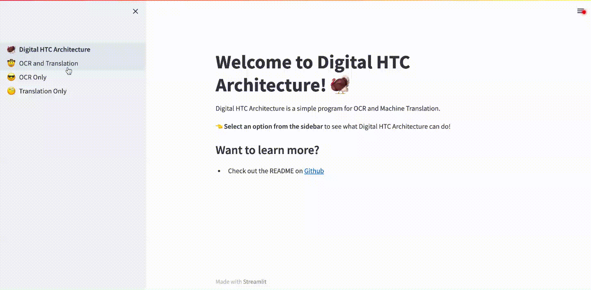

# Digital-HTC-Architecture



 This is a simple program for OCR and Machine Translation of PDF documents.

 The backend uses [Imagemagick](https://imagemagick.org/index.php) for image processing, [Tesseract](https://tesseract-ocr.github.io/) for OCR, and [DeepL](https://www.deepl.com/translator) for translation.
 The frontend is powered by [Streamlit](https://streamlit.io/).

## Example
Original Document
 
 OCR text in original language
 
 Translated text
 

## Instructions
DeepL is used for translation, and an authentication key is needed to access their API. You can get a key for free, but [registration](https://www.deepl.com/pro-api) is required.

### macOS
Strictly speaking, you need macOS Catalina (10.15) or higher with a 64-bit processor. However, I've tested that this works on macOS Mojave (10.14).

To start, one option is to clone this repo. Open a terminal and run:
```
git clone https://github.com/christopher-w-murphy/Digital-HTC-Architecture.git
```
Alternatively, one may download the code by clicking the green Code button and then Download ZIP.

In either case, move into the repo directory and run the installer script:
```
cd Digital-HTC-Architecture/
bash macos_installer.sh
```

While still in the `Digital-HTC-Architecture` directory, start the program by running the following command in a terminal:
```
bash ocr_and_machine_translation.sh
```
You can now view the Streamlit app in your [browser](http://localhost:8501).
To stop running the app enter `control+c` in the terminal.

### Docker
Docker users can pull the image from [Dockerhub](https://hub.docker.com/r/murphycw/digital-htc-architecture)
```
docker pull murphycw/digital-htc-architecture
```
Run the image as a container to start the program
```
docker run -d -p 8501:8501 murphycw/digital-htc-architecture
```
Note that the Docker image has Tesseract v4 as opposed to v5, and can only OCR English and French documents.

Also, the Docker image was build on a Mac with an Intel processor.
As such it will not currently run on an M1 or M2 process because of the difference in [CPU instruction sets](https://pythonspeed.com/articles/docker-build-problems-mac/), which is in conflict with Docket's promise of reproducibility.

### Windows
[Programming Historian](https://programminghistorian.org/en/lessons/OCR-and-Machine-Translation) has instructions for a Windows for an OCR and translation program.
