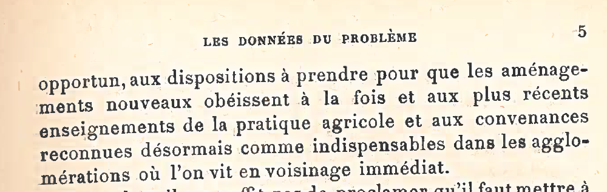
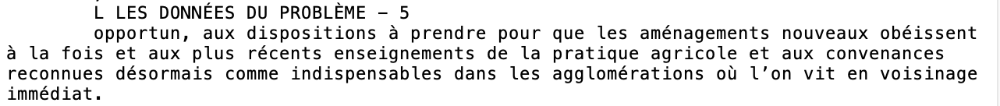
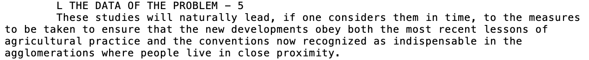
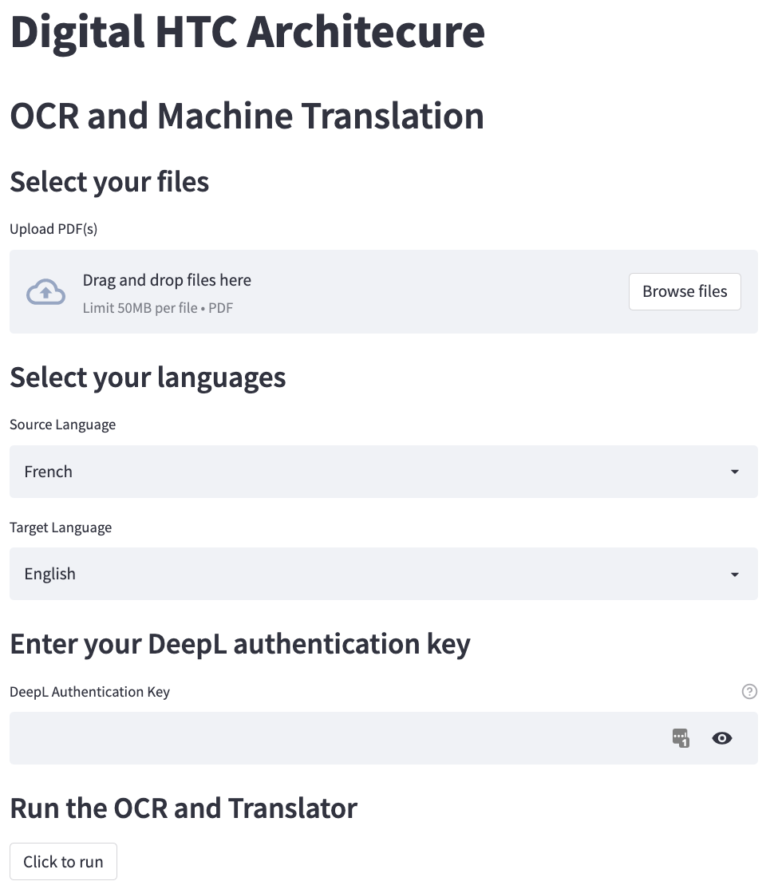

# Digital-HTC-Architecture
 This is a simple program for OCR and Machine Translation of PDF documents.

 The backend uses [Imagemagick](https://imagemagick.org/index.php) for image processing, [Tesseract](https://tesseract-ocr.github.io/) for OCR, and [DeepL](https://www.deepl.com/translator) for translation. The frontend is powered by [Streamlit](https://streamlit.io/).

## Example
Original Document
 
 OCR text in original language
 
 Translated text
 

## Instructions
These instructions are for macOS. Strictly speaking, you need macOS Catalina (10.15) or higher with a 64-bit processor. However, I've tested that this works on macOS Mojave (10.14). [Programming Historian](https://programminghistorian.org/en/lessons/OCR-and-Machine-Translation) has instructions for Windows for an OCR and translation program.

### Setup
The Setup step only need to be run once.

To start, one option is to clone this repo. Open a terminal and run:
```
git clone https://github.com/christopher-w-murphy/Digital-HTC-Architecture.git
```
Alternatively, one may download the code by clicking the green Code button and then Download ZIP.

In either case, move into the repo directory and run the installer script:
```
cd Digital-HTC-Architecture/
bash macos_installer.sh
```

DeepL is used for translation, and an authentication key is needed to access their API. You can get a key for free, but [registration](https://www.deepl.com/pro-api) is required. Treat this key as you would a password. The Streamlit app is stateless, so it won't remember your key. However, you can store your key in a password manager.

### Running the OCR and Translation Program
While still in the `Digital-HTC-Architecture` directory, start the program by running the following command in a terminal:
```
bash ocr_and_machine_translation.sh
```
You can now view the Streamlit app in your [browser](hhttp://localhost:8501). The UI should look something like this:
 
As it currently stands, there's an [issue](https://github.com/streamlit/streamlit/issues/4658) with Streamlit that prevents the app from being displayed in Safari. Using Chrome as a browser works. To stop running the app enter `control+c` in the terminal.

## Language Codes
Codes for specifying the language(s) of documents. Currently the program reads in French and translates to (British) English. A straightforward generalization would be to make the languages configurable.
- [Tesseract](https://github.com/tesseract-ocr/tesseract/blob/main/doc/tesseract.1.asc#LANGUAGES)
- [DeepL](https://www.deepl.com/docs-api/translating-text/?utm_source=github&utm_medium=github-python-readme)
